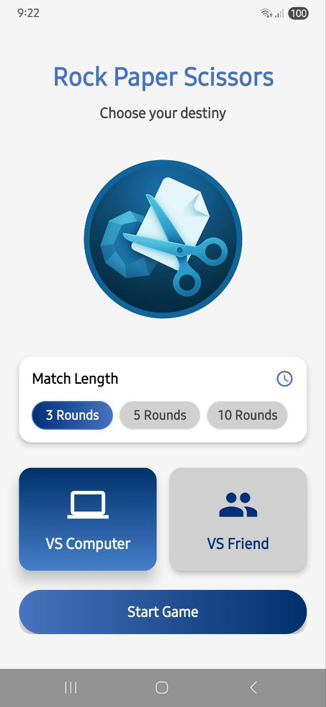
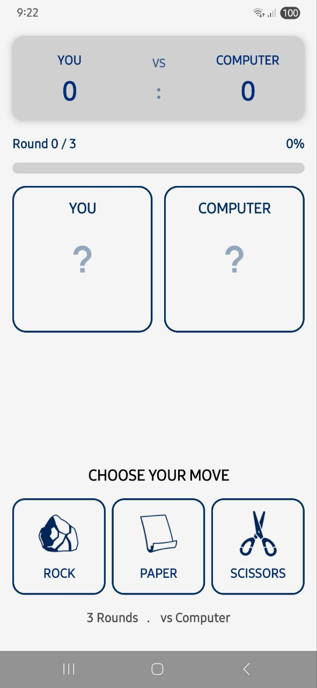
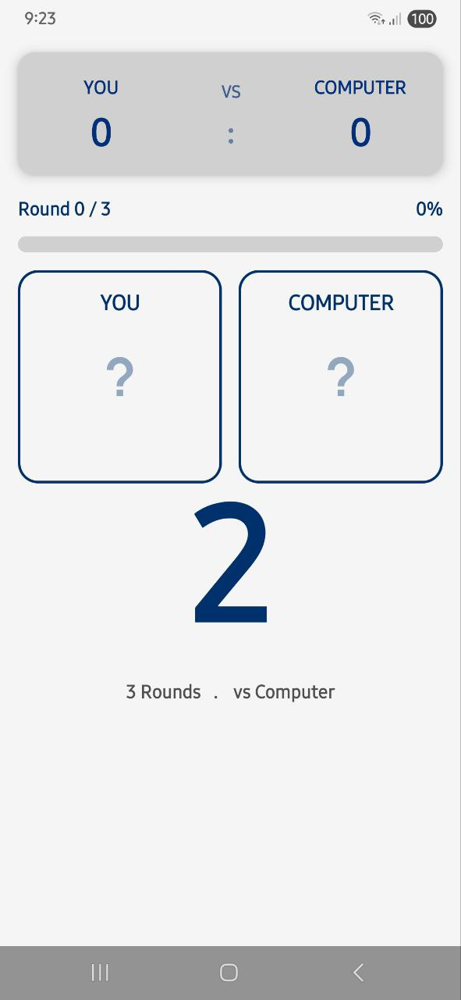
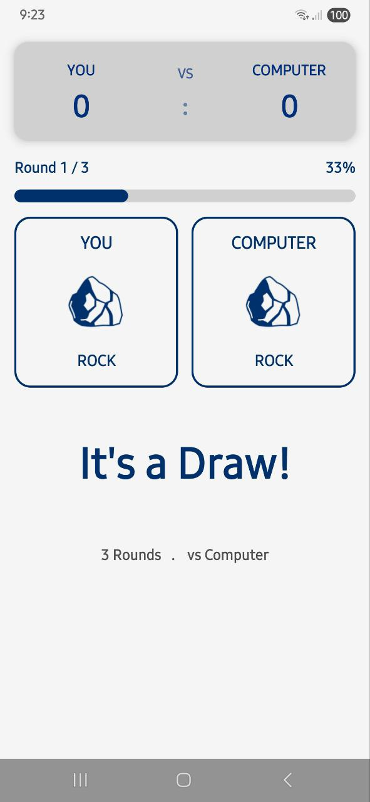
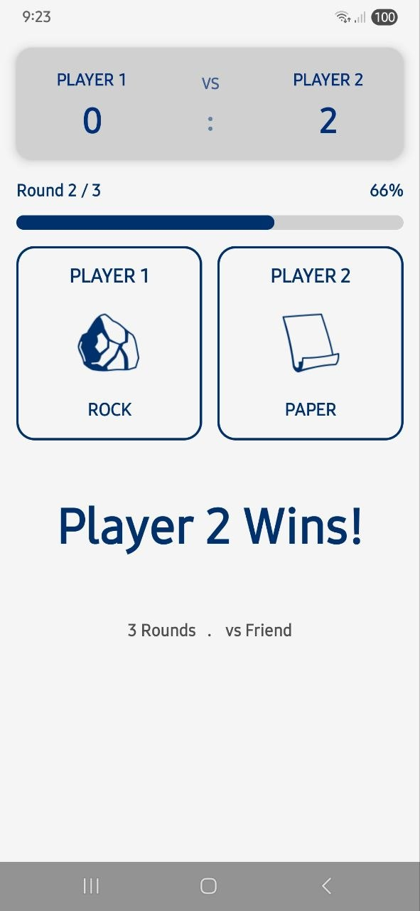
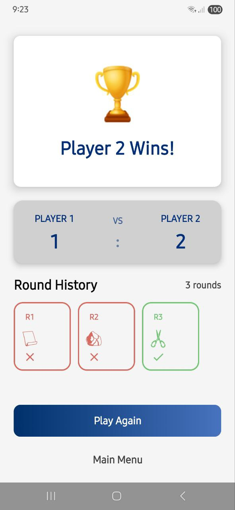
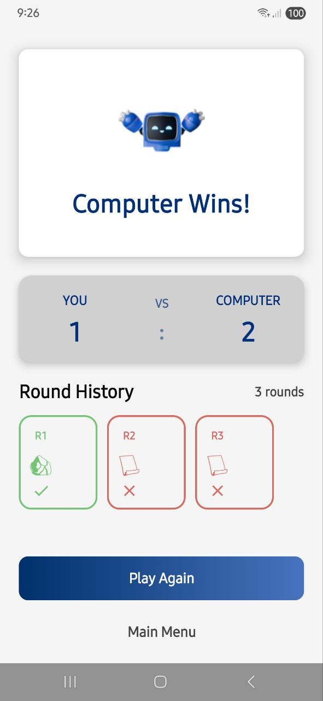

# 🪨 📄 ✂️ Rock Paper Scissors Game

<div align="center">

<br>
A beautifully designed, feature-rich Rock Paper Scissors game built with modern Android technologies
<br><br>


</div>

---

## 📱 Screenshots

<div align="center">

### 🏁 Game Flow Screens

| Home Screen | VS Computer | Counter Screen |
|:---:|:---:|:---:|
|  |  |  |

<br>

| Round Winner (1) | Round Winner (2) |
|:---:|:---:|
|  |  |

<br>

| Game Result: Win | Game Result: Lose |
|:---:|:---:|
|  |  |

</div>

---

## ✨ Features

### 🎮 Game Modes
- **VS Computer**: Challenge the AI in strategic battles
- **VS Friend**: Play locally with a friend on the same device
- **Multiple Rounds**: Choose from 3, 5, or 10 rounds per game

### 🎯 Game Features
- **Smooth Animations**: Countdown timers, choice reveals, and result animations
- **Round History**: Track all previous rounds with visual indicators
- **Score Tracking**: Real-time score updates with elegant UI
- **Winner Detection**: Automatic winner calculation and celebration screens

### 🎨 UI/UX Design
- **Modern Material Design**: Following Material 3 guidelines
- **Custom Color Palette**: Professional blue-themed color scheme
- **Responsive Layout**: Adapts to different screen sizes
- **Visual Feedback**: Interactive buttons with selection states

### ⚙️ Technical Features
- **Clean Architecture**: Separation of concerns with clear layers
- **Dependency Injection**: Using Dagger Hilt for better testability
- **State Management**: Reactive UI with Kotlin Flows
- **Navigation**: Type-safe navigation with arguments
- **Offline Support**: All data stored locally

---

## 🏗️ Architecture

```text
com.example.rpsgame
├── data                # Data Layer
│   ├── datasource      # Data sources (Local/Remote)
│   ├── model           # Data classes and enums
│   └── repository      # Repository implementations
├── domain              # Domain Layer
│   ├── engine          # Game logic and rules
│   └── usecase         # Business logic use cases
├── ui                  # Presentation Layer
│   ├── components      # Reusable Compose components
│   ├── navigation      # Navigation setup
│   ├── screen          # Screen composables
│   ├── theme           # Theme and styling
│   └── utils           # Utility functions
└── di                  # Dependency Injection
```
---

## 🛠️ Tech Stack

- **Language:** Kotlin
- **UI Framework:** Jetpack Compose
- **Architecture:** MVVM with Clean Architecture
- **DI:** Dagger Hilt
- **Navigation:** Compose Navigation
- **State Management:** Kotlin Flows
- **Build System:** Gradle with Kotlin DSL
- **Min SDK:** Android 7.0 (API 24)

---

## 🚀 Getting Started

### Prerequisites
- Android Studio Flamingo or later
- Android SDK 33+
- JDK 17+

### Installation
1. Clone the repository:
```bash
git clone [https://github.com/yourusername/rps-game.git](https://github.com/yourusername/rps-game.git)
cd rps-game
```
2. Open the project in Android Studio

3. Wait for Gradle sync to complete

4. Run on a device or emulator

---
### Build Commands

```bash
# Clean build
./gradlew clean

# Build debug APK
./gradlew assembleDebug

# Run tests
./gradlew test
```

----

### 🎮 How to Play

## Starting a Game
1. Open the app to the main screen

2. Select game mode:
   
   VS Computer
   VS Friend

3. Choose match length (3, 5, or 10 rounds)

4. Tap Start Game

Playing a Round
## VS Computer Mode:

- Tap your choice (Rock, Paper, or Scissors)

- Watch countdown animation

- See computer's choice revealed

View round result

## VS Friend Mode:

- Player 1 selects choice

- Pass device to Player 2

- Player 2 selects choice

- Both choices revealed simultaneously

----

### Game Rules
- ✊ Rock beats ✌️ Scissors

- 🖐️ Paper beats ✊ Rock

- ✌️ Scissors beats 🖐️ Paper

- Same choice = Draw

----

### 🎨 Theme & Styling
Custom blue-themed color palette:

```bash
val PrimaryColor = Color(0xFF4873BE)       // Main blue
val PrimaryDarkColor = Color(0xFF022F7A)   // Dark blue
val SecondaryColor = Color(0xFF4680C9)     // Secondary blue
val SecondaryDarkColor = Color(0xFF00316C) // Dark secondary
val SurfaceColor = Color(0xFFFFFFFF)       // Card backgrounds
```

----

### 🔧 Configuration
## Build Variants:

- Debug: For development with logging

- Release: For production with minification

## Main Dependencies:

- androidx.compose.*: UI framework

- dagger.hilt.*: Dependency injection

- androidx.navigation.*: Navigation

- kotlinx.coroutines.*: Async operations
